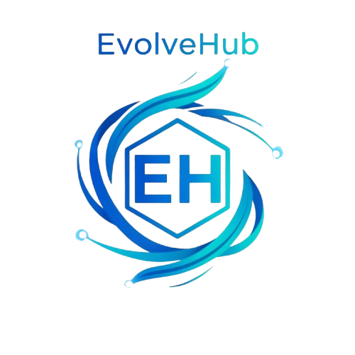
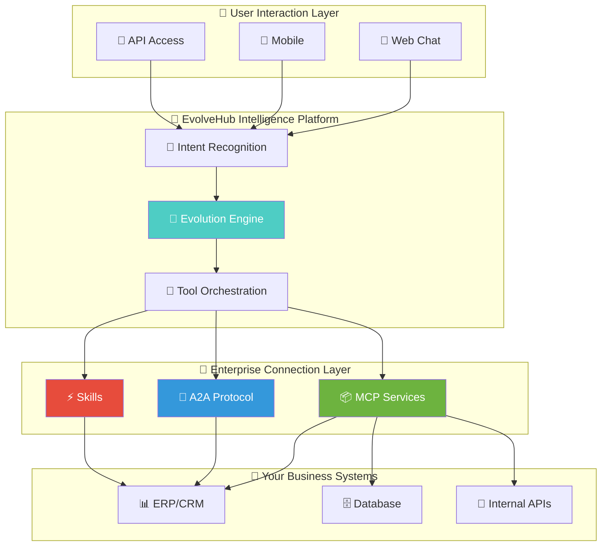
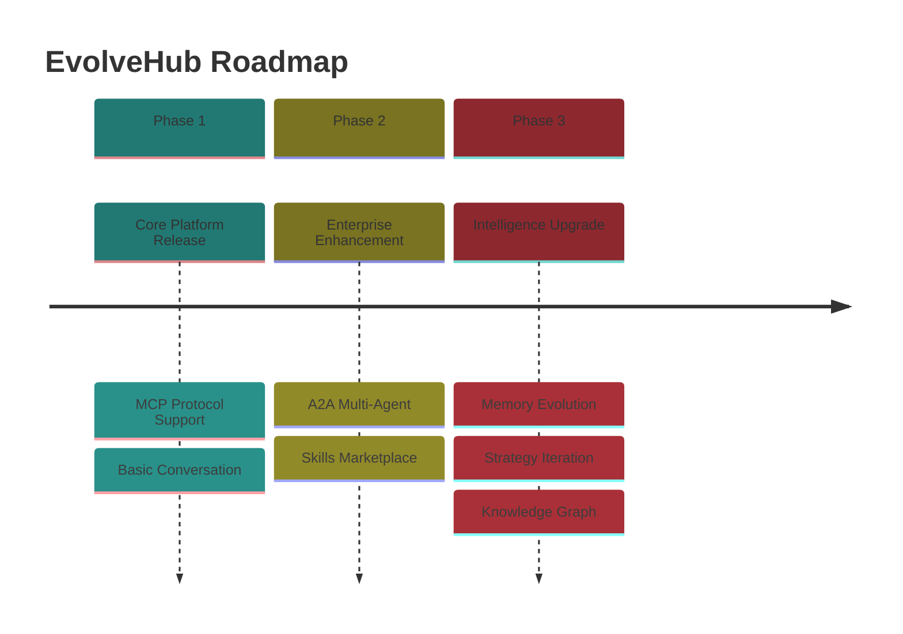

<div align="center">

<!-- Header Wave -->


<!-- Logo -->
<picture>
  <source media="(prefers-color-scheme: dark)" srcset="docs/logo.svg">
  <source media="(prefers-color-scheme: light)" srcset="docs/logo.svg">
  
</picture>

<br/>

<!-- Animated Title -->
<h1>
  
</h1>

<!-- Subtitle -->
<p>
  
</p>

**Enterprise AI Conversational Platform · Ready to Use · Zero Code**

<br/>
<br/>

<!-- Badge Wall -->
<p>
  
  
  
  
</p>

<p>
  <a href="README_zh.md">
    
  </a>
</p>

<!-- Footer Wave -->


</div>

---

## 🎯 What is EvolveHub?

<div align="center">

| 🧬 | **EvolveHub = Enterprise Claude** |
|:--:|:----------------------------------|

</div>

> **EvolveHub** is a ready-to-use enterprise AI platform. No coding required — simply connect your company's **MCP services** or **A2A protocol**, and AI can seamlessly interact with your business systems.

<br/>

<div align="center">

### 🪄 One Sentence Summary

**Configure and use. Connect everything. Let AI understand and operate your enterprise systems.**

</div>

---

## ✨ Core Capabilities

<div align="center">

<table>
<tr>
<td width="50%" valign="top">

### 🔌 Plug & Play


- 📦 **Ready to Use** — No development needed, configure and go
- 🔗 **MCP Protocol** — Compatible with ModelScope MCP ecosystem
- 🤝 **A2A Protocol** — Multi-agent interconnection support
- ⚡ **Skills Extension** — One-click enterprise skill packages

```diff
+ Zero-code integration
+ Minutes-level deployment
+ Enterprise-grade security
```

</td>
<td width="50%" valign="top">

### 🧠 Intelligent Evolution


- 🧬 **Memory Evolution** — AI understands your business better over time
- ⚡ **Strategy Iteration** — Auto-optimizes conversation strategies
- 🤝 **Collaborative Emergence** — Multi-agent intelligent collaboration
- 📊 **Knowledge Accumulation** — Continuous enterprise knowledge building

```diff
+ Gets smarter with use
+ Deeper business understanding
+ More precise decisions
```

</td>
</tr>
</table>

</div>

---

## 🏗️ Platform Architecture

<div align="center">



</div>

---

## 🚀 Use Cases

<div align="center">

| Scenario | Description | Benefit |
|:--------:|:------------|:-------:|
| 💬 **Smart Customer Service** | AI understands business, auto-queries orders, handles tickets | 80% efficiency boost |
| 📊 **Data Assistant** | Natural language database queries, report generation | Zero SQL barrier |
| 🔧 **Ops Assistant** | AI executes operations, auto-troubleshoots | 70% faster response |
| 📋 **Workflow Approval** | Intelligent approval understanding, decision support | 3x faster approval |
| 🎓 **Training Tutor** | Q&A based on enterprise knowledge base | 60% lower training cost |

</div>

---

## 🔌 Integration Methods

### Method 1: MCP Protocol

Simply configure your MCP service endpoint, platform auto-discovers and loads tools:

```yaml
# evolverhub-config.yaml
mcp:
  servers:
    - name: "company-erp"
      endpoint: "https://erp.company.com/mcp"
      auth:
        type: "bearer"
        token: "${ERP_API_TOKEN}"
```

### Method 2: A2A Protocol

Register your Agent to A2A network for multi-agent collaboration:

```yaml
a2a:
  registry: "nacos://localhost:8848"
  agents:
    - name: "order-agent"
      capability: "Order Query & Processing"
    - name: "inventory-agent"
      capability: "Inventory Management"
```

### Method 3: Skills Packages

Import pre-built enterprise skill packages for instant business capabilities:

```yaml
skills:
  - name: "database-query"
    version: "1.0.0"
  - name: "report-generator"
    version: "2.1.0"
```

---

## 🆚 Comparison with Traditional Solutions

<div align="center">

| Dimension | Traditional AI Development | **EvolveHub** |
|:---------:|:--------------------------:|:-------------:|
| Development Cost | 🔴 High (needs AI engineers) | 🟢 Zero-code config |
| Deployment Time | 🔴 Weeks/Months | 🟢 Minutes |
| Business Adaptation | 🔴 Custom development | 🟢 MCP/A2A plug-and-play |
| Knowledge Building | 🔴 Static Prompts | 🟢 Auto-evolution accumulation |
| Maintenance Cost | 🔴 Continuous investment | 🟢 Self-adaptive optimization |

</div>

---

## 📦 Deployment Options

<div align="center">

| Deployment Mode | Use Case | Features |
|:---------------:|:--------:|:--------:|
| 🐳 **Docker** | Quick trial, test environments | One-click startup |
| ☸️ **Kubernetes** | Production, high availability | Elastic scaling |
| 🏢 **On-Premise** | Data-sensitive, compliance | Full control |

</div>

### Docker Quick Start

```bash
# Pull image
docker pull evolvehub/server:latest

# Start service
docker run -d \
  --name evolvehub \
  -p 8080:8080 \
  -v ./config:/app/config \
  evolvehub/server:latest

# Visit http://localhost:8080 to start using
```

---

## 📈 Roadmap



---

## 🤝 Join the Community

<div align="center">

### 📱 Scan to Join DingTalk Group


*Product Inquiry · Technical Discussion · Feedback*

<br/>

</div>

---

## 📄 License

<div align="center">

[](https://opensource.org/licenses/MIT)

</div>

---

<div align="center">

**Made with ❤️ by the EvolveHub Team**


</div>