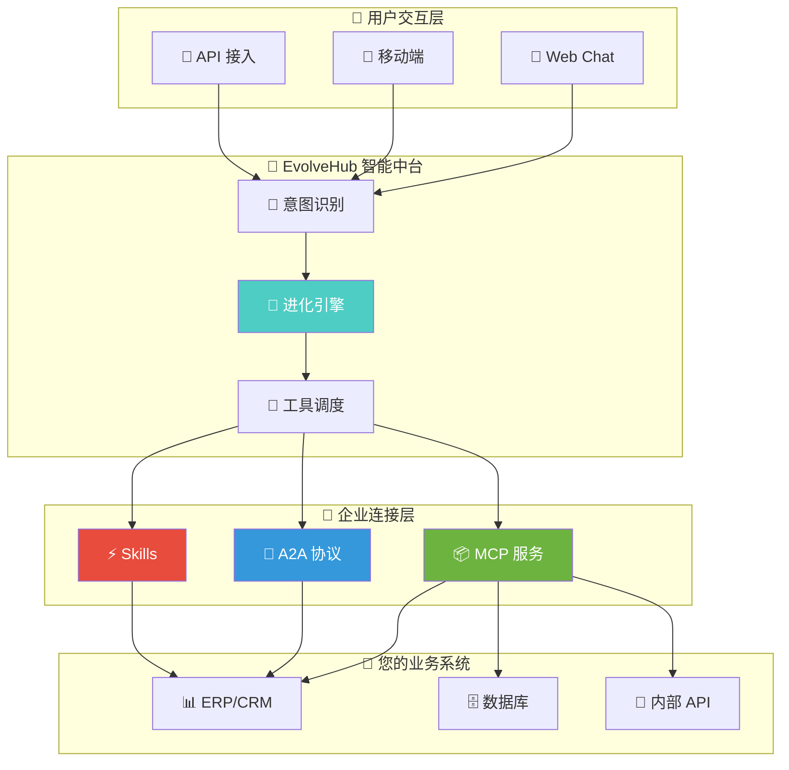
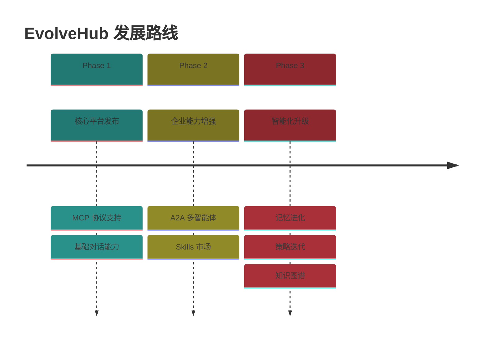

<div align="center">

<!-- 顶部装饰线 -->


<!-- Logo -->
<picture>
  <source media="(prefers-color-scheme: dark)" srcset="docs/logo.svg">
  <source media="(prefers-color-scheme: light)" srcset="docs/logo.svg">
  
</picture>

<br/>

<!-- 动态标题 -->
<h1>
  
</h1>

<!-- 副标题 -->
<p>
  
</p>

**企业级 AI 智能对话平台 · 开箱即用 · 无需编码**

<br/>
<br/>

<!-- 徽章墙 -->
<p>
  
  
  
  
</p>

<p>
  <a href="README.md">
    
  </a>
</p>

<!-- 底部装饰线 -->


</div>

---

## 🎯 什么是 EvolveHub？

<div align="center">

| 🧬 | **EvolveHub = 企业级 Claude** |
|:--:|:------------------------------|

</div>

> **EvolveHub** 是一款开箱即用的企业级 AI 智能平台。无需编写代码，只需接入您公司的 **MCP 服务** 或 **A2A 协议**，即可让 AI 与您的业务系统无缝对话。

<br/>

<div align="center">

### 🪄 一句话概括

**配置即用，连接一切，让 AI 理解并操作您的企业系统**

</div>

---

## ✨ 核心能力

<div align="center">

<table>
<tr>
<td width="50%" valign="top">

### 🔌 即插即用


- 📦 **开箱即用** — 无需开发，配置即可使用
- 🔗 **MCP 协议** — 兼容 ModelScope MCP 生态
- 🤝 **A2A 协议** — 支持多智能体互联
- ⚡ **Skills 扩展** — 一键接入企业技能包

```diff
+ 零代码接入
+ 分钟级部署
+ 企业级安全
```

</td>
<td width="50%" valign="top">

### 🧠 智能进化


- 🧬 **记忆进化** — AI 越用越懂您的业务
- ⚡ **策略迭代** — 自动优化对话策略
- 🤝 **协作涌现** — 多 Agent 智能协作
- 📊 **知识沉淀** — 企业知识持续积累

```diff
+ 越用越聪明
+ 业务理解加深
+ 决策更精准
```

</td>
</tr>
</table>

</div>

---

## 🏗️ 平台架构

<div align="center">



</div>

---

## 🚀 使用场景

<div align="center">

| 场景 | 描述 | 收益 |
|:----:|:-----|:----:|
| 💬 **智能客服** | AI 理解业务，自动查询订单、处理工单 | 效率提升 80% |
| 📊 **数据助手** | 自然语言查询数据库，生成报表 | 零 SQL 门槛 |
| 🔧 **运维助手** | AI 执行运维操作，自动排查故障 | 响应时间 -70% |
| 📋 **流程审批** | 智能理解审批内容，辅助决策 | 审批加速 3x |
| 🎓 **培训导师** | 基于企业知识库的智能问答 | 培训成本 -60% |

</div>

---

## 🔌 接入方式

### 方式一：MCP 协议

只需配置您的 MCP 服务端点，平台自动发现并加载工具：

```yaml
# evolverhub-config.yaml
mcp:
  servers:
    - name: "company-erp"
      endpoint: "https://erp.company.com/mcp"
      auth:
        type: "bearer"
        token: "${ERP_API_TOKEN}"
```

### 方式二：A2A 协议

注册您的 Agent 到 A2A 网络，实现多智能体协作：

```yaml
a2a:
  registry: "nacos://localhost:8848"
  agents:
    - name: "order-agent"
      capability: "订单查询与处理"
    - name: "inventory-agent"
      capability: "库存管理"
```

### 方式三：Skills 技能包

导入预置的企业技能包，快速获得业务能力：

```yaml
skills:
  - name: "database-query"
    version: "1.0.0"
  - name: "report-generator"
    version: "2.1.0"
```

---

## 🆚 对比传统方案

<div align="center">

| 维度 | 传统 AI 开发 | **EvolveHub** |
|:----:|:------------:|:-------------:|
| 开发成本 | 🔴 高（需 AI 工程师） | 🟢 零代码配置 |
| 部署周期 | 🔴 周/月级 | 🟢 分钟级 |
| 业务适配 | 🔴 需定制开发 | 🟢 MCP/A2A 即插即用 |
| 知识沉淀 | 🔴 静态 Prompt | 🟢 自动进化积累 |
| 维护成本 | 🔴 持续投入 | 🟢 自适应优化 |

</div>

---

## 📦 部署方式

<div align="center">

| 部署模式 | 适用场景 | 特点 |
|:--------:|:--------:|:----:|
| 🐳 **Docker** | 快速体验、测试环境 | 一键启动 |
| ☸️ **Kubernetes** | 生产环境、高可用 | 弹性伸缩 |
| 🏢 **私有化部署** | 数据敏感、合规要求 | 完全自主可控 |

</div>

### Docker 快速启动

```bash
# 拉取镜像
docker pull evolvehub/server:latest

# 启动服务
docker run -d \
  --name evolvehub \
  -p 8080:8080 \
  -v ./config:/app/config \
  evolvehub/server:latest

# 访问 http://localhost:8080 开始使用
```

---

## 📈 功能路线



---

## 🤝 加入社区

<div align="center">

### 📱 扫码加入钉钉交流群


*产品咨询 · 技术交流 · 问题反馈*

<br/>

</div>

---

## 📄 许可证

<div align="center">

[](https://opensource.org/licenses/MIT)

</div>

---

<div align="center">

**Made with ❤️ by the EvolveHub Team**


</div>